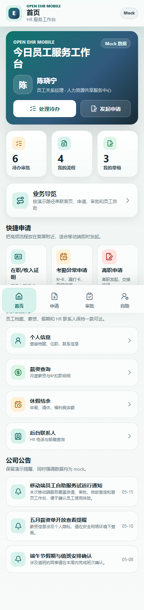
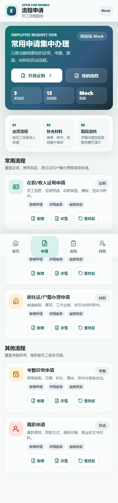
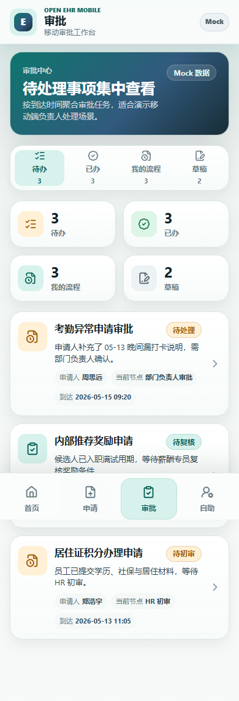
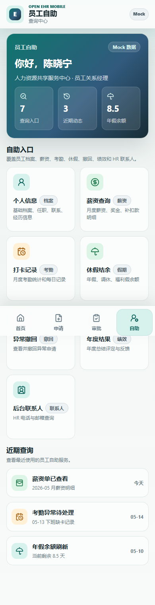
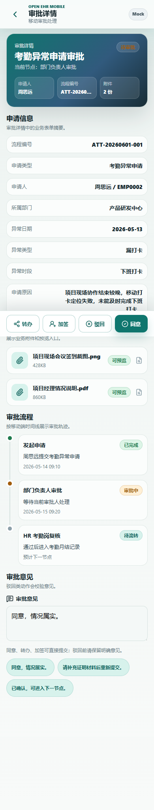

# Open EHR Mobile

Open EHR Mobile 是一个面向企业 HR 数字化、移动端员工自助、申请审批流程演示的开源前端模板。它使用 Vue 3、Vite、TypeScript 和 Vue Router 构建，内置完整 mock 数据和移动端演示路由，适合用于 HR 自助服务原型演示、前端学习、方案展示和二次开发。

本项目中的 EHR 指 Enterprise / Employee HR 场景，不是医疗领域的 openEHR 标准项目。当前版本保持纯前端 mock，不包含后端服务，不连接真实企业微信，不接入真实 HR 数据，也不提供生产环境集成能力。

**在线演示 / Live Demo：** [https://open-ehr-mobile.vercel.app](https://open-ehr-mobile.vercel.app)

## 适用场景

1. HR 数字化方案演示：快速展示移动端员工工作台、流程申请、审批处理和自助查询。
2. 前端模板二次开发：基于 Vue 3 + Vite + TypeScript 继续扩展页面、路由、mock 数据或真实 API 层。
3. 移动端产品原型：作为企业员工服务、流程中心、审批中心、自助查询类产品的交互参考。
4. 开源工程样板：保留轻量依赖、基础验证脚本、开源扫描和移动端 smoke 测试。

## 功能矩阵

| 模块 | 路由入口 | 已覆盖能力 |
| --- | --- | --- |
| 登录入口 | `/login` | 点击进入系统，模拟移动端登录后的首页跳转 |
| 首页工作台 | `/home` | 员工身份卡、待办统计、快捷申请、快捷查询、公告提醒、业务导览 |
| 申请中心 | `/apply` | 在职/收入证明、内部推荐奖励、居住证/户籍办理、考勤异常、离职申请 |
| 申请表单 | `/apply/*` | 新增、详情、重发起、保存草稿、提交申请、附件预览、只读态 |
| 审批中心 | `/approval/todo` | 待办、已办、我的流程、草稿列表、审批详情跳转 |
| 审批详情 | `/approval/detail/todo-001` | 同意、驳回、转办、加签、审批意见、流程轨迹、本地状态反馈 |
| 员工自助 | `/self-service` | 个人信息、薪资、考勤、休假、异常撤回、年度结果、联系人 |
| 演示导览 | `/demo-checklist` | 按首页、申请、审批、自助的推荐路径查看关键页面 |
| 质量验证 | `npm run verify:local` / `npm run test:smoke` | 开源扫描、类型检查、生产构建、主要路由、点击流、核心交互和移动端布局检查 |

## 界面预览

以下截图来自纯前端 mock 演示，已从本地验证目录整理为可公开的 README 资产。

| 首页工作台 | 申请中心 |
| --- | --- |
|  |  |
| 审批中心 | 员工自助 |
|  |  |
| 审批详情处理台 |  |
|  |  |

## 在线与本地演示

公开演示由 Vercel 托管，无需账号即可体验纯前端 mock 流程：

- 在线首页：[https://open-ehr-mobile.vercel.app](https://open-ehr-mobile.vercel.app)
- 登录入口：[https://open-ehr-mobile.vercel.app/login](https://open-ehr-mobile.vercel.app/login)
- 业务导览：[https://open-ehr-mobile.vercel.app/demo-checklist](https://open-ehr-mobile.vercel.app/demo-checklist)

建议使用移动设备访问，或在桌面浏览器中切换到移动设备视图。演示中的人员、薪资、考勤和审批数据均为虚构 mock 数据。

如需本地运行：

```shell
npm install
npm run dev
```

默认开发地址：

```text
http://127.0.0.1:5180
```

如需预览生产构建：

```shell
npm run build
npm run preview
```

默认预览地址：

```text
http://127.0.0.1:4180
```

## 技术栈

1. Vue 3
2. Vite
3. TypeScript
4. Vue Router
5. Playwright

项目暂不引入后端、Pinia 或大型 UI 组件库，保持依赖轻量。图标层使用 `@lucide/vue`，用于提供一致、可访问的线性图标。

## 目录结构

```text
open-ehr-mobile/
├─ docs/
│  ├─ assets/            # README 可公开截图资产
│  ├─ architecture.md
│  ├─ demo-flows.md
│  └─ product-strategy.md
├─ src/
│  ├─ components/        # 页面组件与通用演示组件
│  ├─ data/              # mock 数据与类型定义
│  ├─ router.ts          # Vue Router 路由配置
│  ├─ styles/            # 全局样式与移动端基础变量
│  └─ views/             # 页面视图
├─ scripts/
│  ├─ playwright-smoke.mjs
│  └─ verify-open-source.mjs
├─ index.html
├─ package.json
├─ vite.config.ts
├─ tsconfig.json
├─ .env.example
├─ .gitignore
├─ LICENSE
└─ NOTICE
```

## 开源文档

1. [贡献指南](CONTRIBUTING.md)：说明贡献范围、本地开发、代码规范、mock 数据规范和提交前检查。
2. [安全说明](SECURITY.md)：说明项目安全边界、数据隐私边界、本地存储和问题反馈方式。
3. [产品策略](docs/product-strategy.md)：说明产品定位、目标用户、核心场景、信息架构和开源路线。
4. [架构说明](docs/architecture.md)：说明路由、数据、状态、样式和验证脚本结构。
5. [演示路径](docs/demo-flows.md)：说明首页、申请、审批、自助和业务导览的推荐演示流程。

## 常用命令

```shell
npm run dev
npm run type-check
npm run build
npm run preview
npm run verify:oss
npm run verify:local
npm run test:smoke
```

命令说明：

1. `npm run dev`：启动本地开发服务，默认端口 `5180`。
2. `npm run type-check`：执行 TypeScript 类型检查。
3. `npm run build`：先执行类型检查，再执行生产构建。
4. `npm run preview`：预览生产构建产物，默认端口 `4180`。
5. `npm run verify:oss`：检查开源必需文件、敏感词、本地路径和不应发布的目录。
6. `npm run verify:local`：串联 `verify:oss`、`type-check` 和 `build`，用于不依赖浏览器服务的本地基础门禁。
7. `npm run test:smoke`：执行 Playwright 移动端主链路冒烟验证。

## 页面路由

```text
/login
/home
/demo-checklist
/apply
/apply/on-job
/apply/on-job/detail/CERT-20260601-001
/apply/on-job/reissue/CERT-20260601-001
/apply/recommend-reward
/apply/settle
/apply/attendance-exception
/apply/resignation
/approval/todo
/approval/done
/approval/my-process
/approval/draft
/approval/detail/todo-001
/self-service
/self-service/profile
/self-service/salary
/self-service/attendance
/self-service/vacation
/self-service/cancellation
/self-service/summary-result
/self-service/contact-book
```

## Mock 数据与交互说明

主要 mock 数据位于：

```text
src/data/mock.ts
src/data/types.ts
```

交互模拟说明：

1. 登录入口通过路由跳转模拟，不发起网络请求。
2. 申请表单保存草稿后，会写入浏览器本地存储 `open-ehr-mobile:form-drafts`。
3. 申请表单提交后，会写入浏览器本地存储 `open-ehr-mobile:form-submissions`。
4. 审批详情的同意、驳回、转办、加签会更新页面状态，并写入浏览器本地存储 `open-ehr-mobile:approval-detail-state:{processInstanceId}`。
5. 薪资月份切换、考勤筛选、休假刷新、联系人搜索、撤回申请等均为组件内 mock 交互。

清空浏览器本地存储后，页面会回到内置 mock 初始状态。

## 二次开发路径

1. 接入真实接口：保留当前页面、路由和类型结构，在 `src/data` 外新增 API 层，再逐步替换 mock 数据来源。
2. 接入状态管理：当申请、审批、自助查询出现跨页面共享状态时，再引入 Pinia，避免过早增加全局状态。
3. 扩展设计系统：先统一 token、按钮、标签、列表、表单、弹窗、toast 和图标，再替换具体页面内部结构。
4. 扩展业务流程：优先按申请、审批、自助三大域拆分数据模型和组件，不破坏现有路由矩阵。
5. 发布为内部应用：需要重新审查品牌、文案、数据来源、隐私说明、授权边界和真实系统集成方式。

## 开源边界

1. 本项目是纯前端 mock 演示产品，不包含 Spring Boot、MySQL、Redis 或任何后端服务。
2. 本项目不连接真实企业微信，不读取真实组织、员工、薪资、考勤或审批数据。
3. 本项目不声明兼容医疗领域 openEHR 标准。
4. 本项目内的员工、组织、联系方式、流程编号、附件名称、薪资、考勤、审批、申请单据等内容均为虚构示例。
5. 请勿提交 `node_modules/`、`dist/`、`output/`、本地日志、`handoff.md`、真实账号、真实手机号、真实邮箱、内部路径、企业内部品牌词或密钥。

## 截图与验证

默认 smoke 面向生产预览服务。推荐先构建，再直接运行 smoke；脚本会在 `http://127.0.0.1:4180` 不可达时自动启动临时 Vite preview，并在测试结束后清理：

```shell
npm run build
npm run test:smoke
```

如需人工预览页面，可单独启动 `4180` 端口：

```shell
npm run preview
```

如果使用 `npm run dev` 的 `5180` 端口运行页面，并希望 smoke 复用该服务，请显式指定 smoke 基础地址。推荐使用 `SMOKE_BASE_URL`；`EHR_BASE_URL` 和 `DEMO_BASE_URL` 会继续作为兼容别名：

```shell
# PowerShell
$env:SMOKE_BASE_URL="http://127.0.0.1:5180"; npm run test:smoke

# Bash / zsh
SMOKE_BASE_URL=http://127.0.0.1:5180 npm run test:smoke
```

脚本会使用 `375x812`、`390x844`、`430x932` 三组移动端视口访问主要页面并检查横向滚动；点击流和核心交互默认使用 `390x844`。截图输出到：

```text
output/playwright/
```

注意：`output/` 是本地验证目录，已被 `.gitignore` 忽略；README 公共截图位于 `docs/assets/`，不要直接引用 `output/`。

## 发布前质量门禁

发布或提交前建议先运行基础门禁：

```shell
npm run verify:local
```

完成生产构建并启动预览服务后，再运行移动端 smoke：

```shell
npm run test:smoke
```

`npm run verify:local` 会串联执行 `verify:oss`、`type-check` 和 `build`；`npm run test:smoke` 需要 `npm run preview` 或显式设置 `SMOKE_BASE_URL`。

`npm run verify:oss` 会检查：

1. 开源必需文件是否存在。
2. 业务源码和文档中是否残留旧内部品牌词。
3. 是否出现未脱敏手机号、非示例邮箱、内部地址、本地路径或高风险配置字段。
4. 是否误提交构建产物、依赖目录、验证输出或本地交接文件。

## 路线图

1. 产品定位与文档：完善 README、贡献指南、安全说明、产品策略、架构说明和演示路径。
2. 设计系统：统一 token、色板、字体、间距、圆角、阴影、按钮、标签、图标和状态反馈。
3. 业务域优化：逐步优化申请、审批、自助三大业务域的 loading、empty、error 和 mock 状态。
4. 代码结构：逐步将历史 `demo-*` CSS class/token 产品化命名，抽离本地存储、toast、表单状态等重复逻辑。
5. 验证资产：扩展 Playwright smoke，补齐多视口截图和可公开截图资产。

## 许可

本项目使用 MIT License，详见 `LICENSE`。
